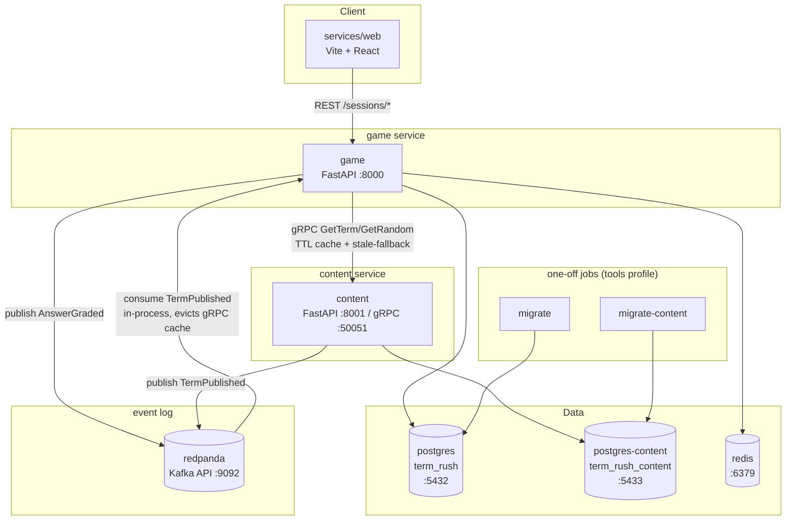
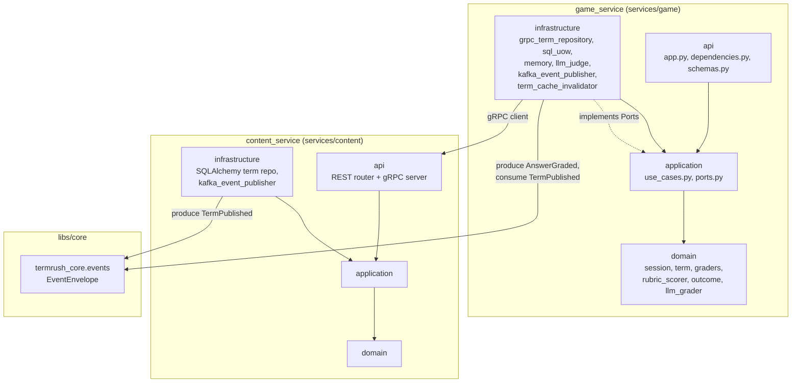
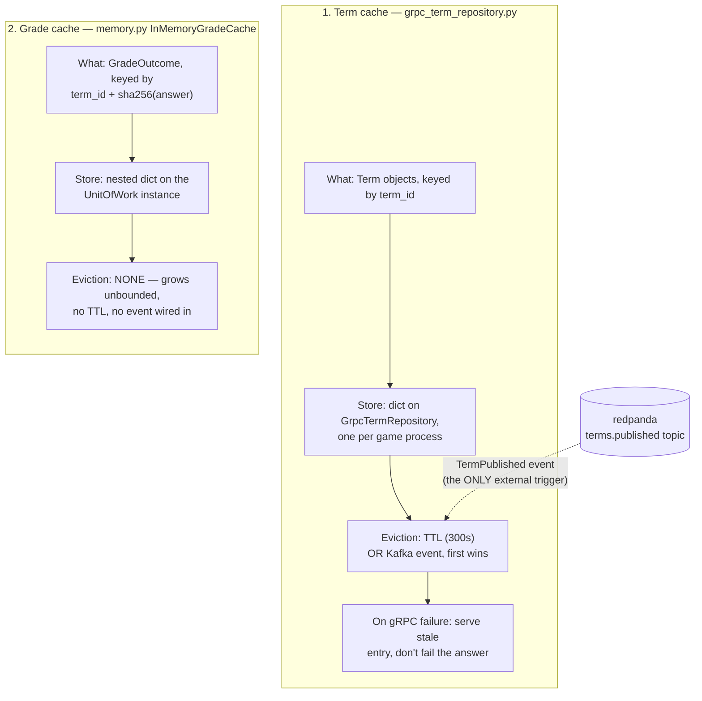
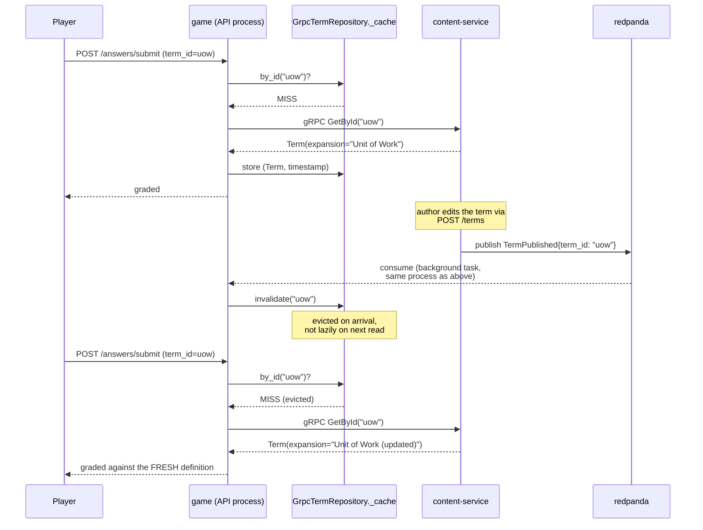

# Architecture Diagrams

Generated by hand from the repo structure and `compose.yml` (the
skill's automated scanner produces only generic templates for this
layout, so these were authored directly). Reflects state after the
Phase 3 game/content service split (see [ADR-0009](adr/0009-grpc-inter-service-communication.md))
and the Kafka event log (Increments 4a/4b, ADR-0011).

## Deployment Diagram



Notes:

- `game` and `content` build from the same image
  (`services/game/Dockerfile`); `content`'s container overrides
  `command` to run `content_service/bin/run.py`. One-image strategy
  per [ADR-0006](adr/0006-one-image-per-service.md).
- `game` has no direct DB access to terms data anymore — the
  drop-terms migration removed that table; all term lookups cross
  the gRPC boundary.
- `migrate` / `migrate-content` run under the `tools` compose profile,
  not part of the always-on topology.
- The `TermPublished` consumer runs as a background task inside `game`'s
  own process (started/stopped via FastAPI lifespan), not a separate
  service: it must share the same in-memory `GrpcTermRepository` instance
  request handlers read from, or invalidating a cache nothing populated
  would be a no-op. See [ADR-0011](adr/0011-kafka-event-log.md).
- `KAFKA_BROKER_URL` unset on either service skips Kafka entirely
  (publisher falls back to an in-memory no-op, no consumer task starts) —
  same optional-dependency pattern as `ANTHROPIC_API_KEY`.

## Component Diagram (per-service layering)



Layering is machine-enforced per service via `import-linter`
(`services/*/pyproject.toml`): `api -> infrastructure -> application
-> domain`, domain framework-free. See
[CLAUDE.md](../CLAUDE.md#architecture-invariants--machine-enforced).

## Caching Strategy & Event-Driven Eviction

Two independent, unrelated caches exist in `game_service`. Only one of
them is wired to the event log:



### Why only the term cache listens to events

- **Term cache** caches content-service's data — data `game_service`
  does not own and cannot know has changed except by being told. The
  event log is that notification channel: `content-service` publishes
  `TermPublished` the moment an authoring write commits, and the same
  process that serves grading requests consumes it and evicts. The
  300s TTL is the fallback for the case where the event never arrives
  (`KAFKA_BROKER_URL` unset, consumer briefly down, message lost) — an
  *upper bound* on staleness, not the primary mechanism.
- **Grade cache** caches `game_service`'s own computed output for a
  fixed input (`term_id + answer` → a deterministic grading result,
  same terms doc that already states the grading path is
  deterministic per input). There is nothing external that
  invalidates a grading verdict — the same answer to the same term
  always deserves the same outcome, permanently, for as long as the
  cache entry's process lives. It has no eviction because it needs
  none, not because eviction was skipped.

### Sequence: a term update invalidates a live, in-flight cache



Verified live (not just unit-tested): a `POST /terms` update on
content-service produced `"Invalidated cached term uow"` in `game`'s
logs within ~2s, and the next submitted answer's feedback reflected
the updated `expansion` text — confirming eviction, not just a log
line.

### Tracking this in git

Both caches and the event log are ordinary tracked files, so their
evolution is visible with:

```bash
git log --oneline -- \
  services/game/game_service/infrastructure/grpc_term_repository.py \
  services/game/game_service/infrastructure/memory.py \
  services/game/game_service/infrastructure/kafka_event_publisher.py \
  services/game/game_service/infrastructure/term_cache_invalidator.py \
  services/content/content_service/infrastructure/kafka_event_publisher.py \
  libs/core/src/termrush_core/events.py
```

This diagram itself is versioned in this file — a future change to
either cache's eviction policy, or a new event type, is a diff here
alongside the code diff, not a separate untracked artifact.
