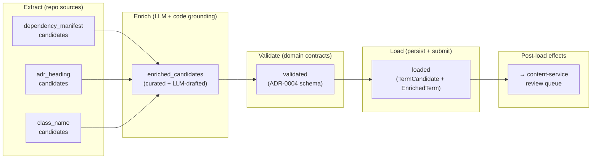
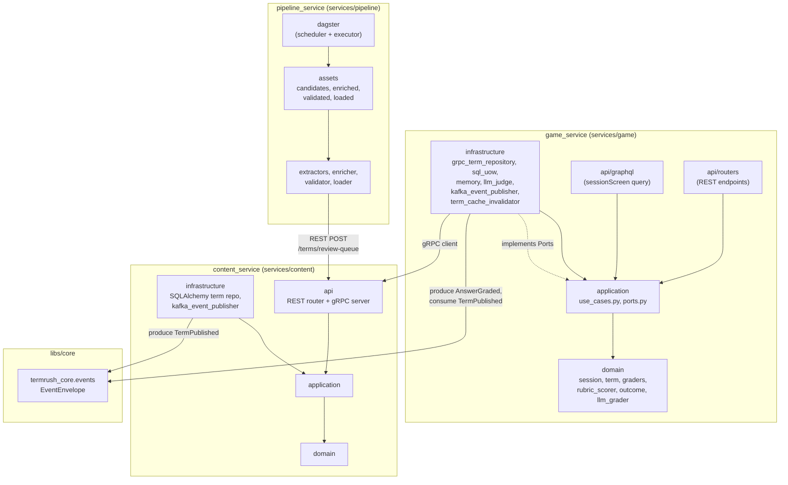
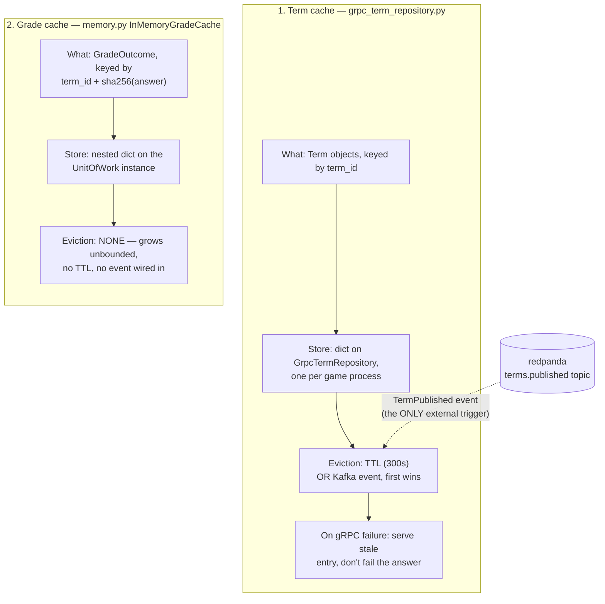
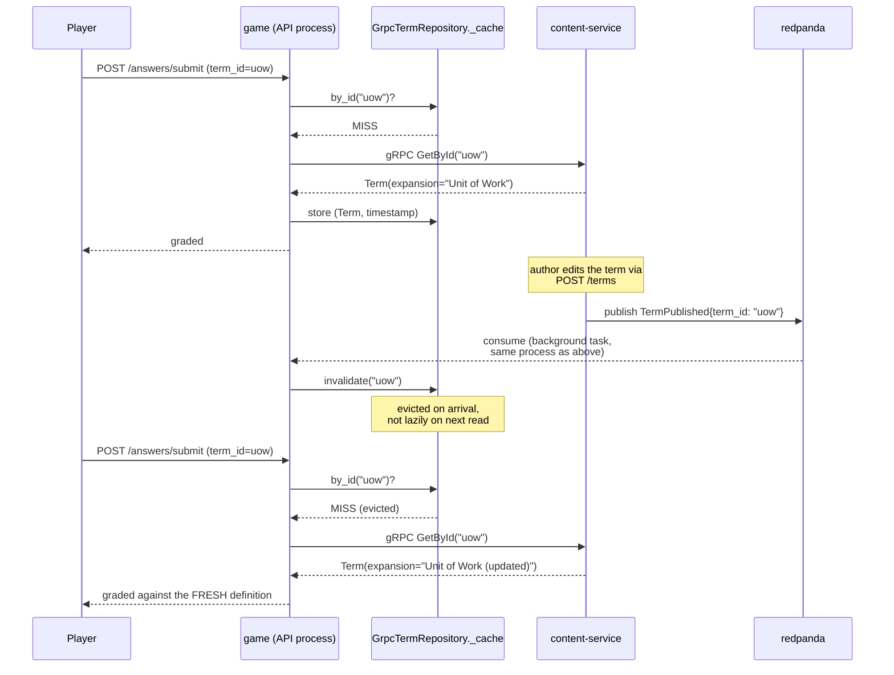

# Architecture Diagrams

Generated by hand from the repo structure and `compose.yml` (the
skill's automated scanner produces only generic templates for this
layout, so these were authored directly). Reflects state after the
Phase 3 game/content service split (see [ADR-0009](adr/0009-grpc-inter-service-communication.md)),
the Kafka event log (ADR-0011), the GraphQL BFF (ADR-0010), and the
Dagster pipeline service for term ingestion (ADR-0004).

## Deployment Diagram

```mermaid
graph TB
    subgraph Client
        web["services/web<br/>Vite + React"]
    end

    subgraph "game service"
        direction TB
        rest_api["REST API<br/>:8000"]
        graphql["GraphQL BFF<br/>(sessionScreen query)"]
        game["game logic"]

        rest_api --> game
        graphql --> game
    end

    subgraph "content service"
        content["REST API + gRPC<br/>:8001 / :50051"]
    end

    subgraph "pipeline service"
        pipeline["Dagster assets<br/>extract → enrich →<br/>validate → load"]
    end

    subgraph Data
        pg_game[("postgres<br/>term_rush<br/>:5432")]
        pg_content[("postgres-content<br/>term_rush_content<br/>:5433")]
        redis[("redis<br/>:6379")]
    end

    subgraph "event log"
        redpanda[("redpanda<br/>Kafka API :9092")]
    end

    subgraph "one-off jobs (tools profile)"
        migrate["migrate"]
        migrate_content["migrate-content"]
    end

    web -->|REST /sessions/*| rest_api
    web -->|POST /graphql<br/>(sessionScreen)| graphql
    game -->|gRPC GetTerm/GetRandom<br/>TTL cache + stale-fallback| content
    pipeline -->|REST<br/>load to term review queue| content
    game --> pg_game
    game --> redis
    content --> pg_content
    migrate --> pg_game
    migrate_content --> pg_content
    game -->|publish AnswerGraded| redpanda
    content -->|publish TermPublished| redpanda
    redpanda -->|consume TermPublished<br/>in-process, evicts gRPC cache| game
```

Notes:

- `game` and `content` build from the same image
  (`services/game/Dockerfile`); `content`'s container overrides
  `command` to run `content_service/bin/run.py`. One-image strategy
  per [ADR-0006](adr/0006-one-image-per-service.md).
- `pipeline` is a separate service (Dagster scheduler + executor) that
  ingests candidate terms from repo sources, enriches them via Claude LLM
  (grounded by real code snippets), validates with domain schemas, and
  loads approved terms into `content-service`'s review queue. See
  [ADR-0004](adr/0004-term-ingestion-pipeline.md).
- `game` exposes two surfaces: REST (`/sessions/*, /game-config, /terms/*`)
  and GraphQL (`POST /graphql`, single `sessionScreen` query that batches
  three REST reads into one round trip). See [ADR-0010](adr/0010-graphql-bff-for-session-screen.md).
- `game` has no direct DB access to terms data anymore — the
  drop-terms migration removed that table; all term lookups cross
  the gRPC boundary.
- `migrate` / `migrate-content` run under the `tools` compose profile,
  not part of the always-on topology.
- The `TermPublished` consumer runs as a background task inside `game`'s
  own process (started/stopped via FastAPI lifespan), not a separate
  service: it must share the same in-memory `GrpcTermRepository` instance
  request handlers read from, or invalidating a cache nothing populated
  would be a no-op. See [ADR-0011](adr/0011-kafka-event-log.md).
- `KAFKA_BROKER_URL` unset on either service skips Kafka entirely
  (publisher falls back to an in-memory no-op, no consumer task starts) —
  same optional-dependency pattern as `ANTHROPIC_API_KEY`.

## Dagster Pipeline Workflow

The term ingestion pipeline runs as a scheduled Dagster job that transforms
repo sources into curated, review-queue terms. Five-stage asset graph:



**Extract stage (sources):**

- **Dependency manifests** (highest confidence): structured, machine-
  parseable — one candidate per unique package name found in `pyproject.toml`
  files. Source: `extractors/dependency_manifest.py`.
- **ADR headings** (medium confidence): backtick-quoted identifiers from ADR
  heading prose. Source: `extractors/adr_headings.py`.
- **Class/Protocol names** (medium confidence): project-local jargon from
  documented public `class` and `Protocol` definitions, excluding API/protobuf.
  Source: `extractors/class_names.py`.

**Enrich stage:**

- Deduplicates extracted candidates by normalized term key (e.g. `TCP/IP` ==
  `TCP IP`; ties broken by explicit confidence rank, not merge order).
- Loads the hand-authored curated source (`curated_terms.yaml`) — each curated
  term skips the LLM call entirely (human already wrote the knowledge object).
- For each extracted candidate, calls Claude with the term name + 2–3 code
  snippets showing real usage, generating `EnrichedTerm` (definition, examples,
  confidence score).
- Pairs each enriched term with its `TermCandidate` (provenance tracking for
  the load stage).

**Validate stage:**

- Ensures every `EnrichedTerm` matches ADR-0004's schema contract:
  `expansion`, `concept`, `purpose`, `example` fields with length bounds,
  `confidence` in `[0.0, 1.0]`, and `source_type` from an enum.
- Typed `ValidationResult` per candidate; errors surfaced as structured logs,
  not exceptions (EAFP pattern).

**Load stage:**

- POSTs validated pairs to `content-service`'s REST `/terms/review-queue` API.
- Receives back `(term_id, review_id)` for each successful load, or a
  `409 Conflict` if a review already exists for that term name.
- Batches submissions to avoid single-point-of-failure per term.

## GraphQL BFF (sessionScreen Query)

The game-service exposes a GraphQL BFF (Strawberry) alongside REST. One query,
`sessionScreen`, batches three independent REST reads into a single round trip:

```graphql
query SessionScreen($category: String) {
  sessionScreen(category: $category) {
    gameConfig {
      modes { mode maxAnswers timed llmGrading }
      sprint { startDate endDate }
      rubric { expansion concept purpose example }
    }
    termCategories { slug label }
    randomTerm { termId prompt difficulty }
  }
}
```

**Flow:**

1. Client POST `/graphql` with `sessionScreen(category)` query
2. GraphQL router (in `api/graphql/schema.py`) receives the request
3. `sessionScreen` field resolver calls three use cases (same ones REST
   routers call):
   - `GetGameConfig()` → `game.constants.GameConfig`
   - `ListTermCategories()` → `[Category, ...]`
   - `GetNextTerm(category=category)` → optional `Term` (null if empty bank)
4. GraphQL types mirror REST response shapes; values are constructed identically
5. Return single `SessionScreen` object with all three fields populated

**Why GraphQL, not REST embedding:**

- Eliminates three round trips (network latency + client Promise.all coordination)
- Typed schema + introspection (client codegen, IDE intellisense)
- Stateless; each query is independent (no session state, no auth yet)
- REST endpoints remain the source of truth per ADR-0017; GraphQL composes,
  doesn't replace

See [ADR-0010](adr/0010-graphql-bff-for-session-screen.md) for design trade-offs.

## Component Diagram (per-service layering)



Layering is machine-enforced per service via `import-linter`
(`services/*/pyproject.toml`): `api -> infrastructure -> application
-> domain`, domain framework-free. See
[CLAUDE.md](../CLAUDE.md#architecture-invariants--machine-enforced).

**Pipeline service** (`services/pipeline/`) deviates by design: Dagster assets
are the entry point (the "api" layer in this context), not a FastAPI router.
Assets orchestrate domain logic (extractors, enricher, validator, loader),
which are framework-free. The scheduler and executor themselves are outside
the layering contract — they coordinate the assets, not vice versa.

## Caching Strategy & Event-Driven Eviction

Two independent, unrelated caches exist in `game_service`. Only one of
them is wired to the event log:



### Why only the term cache listens to events

- **Term cache** caches content-service's data — data `game_service`
  does not own and cannot know has changed except by being told. The
  event log is that notification channel: `content-service` publishes
  `TermPublished` the moment an authoring write commits, and the same
  process that serves grading requests consumes it and evicts. The
  300s TTL is the fallback for the case where the event never arrives
  (`KAFKA_BROKER_URL` unset, consumer briefly down, message lost) — an
  *upper bound* on staleness, not the primary mechanism.
- **Grade cache** caches `game_service`'s own computed output for a
  fixed input (`term_id + answer` → a deterministic grading result,
  same terms doc that already states the grading path is
  deterministic per input). There is nothing external that
  invalidates a grading verdict — the same answer to the same term
  always deserves the same outcome, permanently, for as long as the
  cache entry's process lives. It has no eviction because it needs
  none, not because eviction was skipped.

### Sequence: a term update invalidates a live, in-flight cache



Verified live (not just unit-tested): a `POST /terms` update on
content-service produced `"Invalidated cached term uow"` in `game`'s
logs within ~2s, and the next submitted answer's feedback reflected
the updated `expansion` text — confirming eviction, not just a log
line.

### Tracking this in git

Both caches and the event log are ordinary tracked files, so their
evolution is visible with:

```bash
git log --oneline -- \
  services/game/game_service/infrastructure/grpc_term_repository.py \
  services/game/game_service/infrastructure/memory.py \
  services/game/game_service/infrastructure/kafka_event_publisher.py \
  services/game/game_service/infrastructure/term_cache_invalidator.py \
  services/content/content_service/infrastructure/kafka_event_publisher.py \
  libs/core/src/termrush_core/events.py
```

This diagram itself is versioned in this file — a future change to
either cache's eviction policy, or a new event type, is a diff here
alongside the code diff, not a separate untracked artifact.
