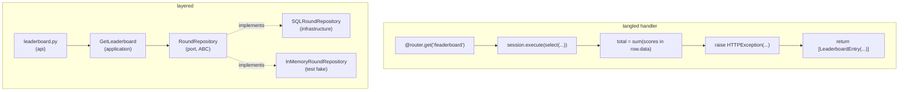
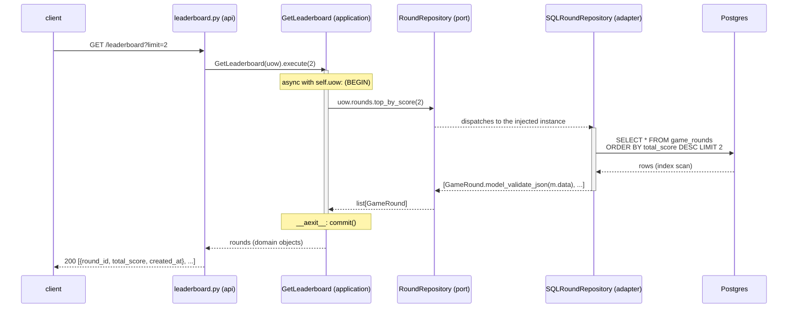
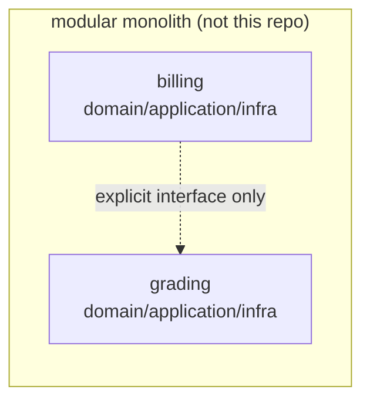

# Ports, Adapters &amp; Unit of Work

Traced through one real request - `GET /leaderboard?limit=2` - rather than
abstract boxes. See [skills-map.md](skills-map.md) for where this fits in
the broader skills ledger.

## 1. Why split at all

The monolith failure mode isn't "one file is bad." It's that business logic
and a framework call end up in the same function, so testing the logic
means paying for the framework, and swapping the framework means rewriting
the logic.

Left: SQL, the scoring rule, and the HTTP shape all live in one function -
testing the scoring rule means booting FastAPI and a live Postgres. Right:
`GetLeaderboard` only calls `RoundRepository` (a port); which concrete
class answers is decided outside the use case, so a test swaps in the
in-memory fake and never touches SQL.

## 2. The actual request

The port (`RoundRepository`, an ABC) is a name the use case calls; the
adapter (`SQLRoundRepository`) is the object actually bound to it, chosen
once at request setup by `api/dependencies.py`. `GetLeaderboard` never
imports SQLAlchemy - swap Postgres for anything else and this file doesn't
change.

## 3. What each piece is actually for

- **Domain** - `GameRound`, `total_score`. Plain Python/Pydantic. No
  SQLAlchemy or FastAPI import is even legal here - import-linter fails the
  build if one sneaks in. This is the one layer that would survive a full
  framework rewrite unchanged.
- **Port** - `RoundRepository(ABC)` in `application/ports.py`. Not code
  that runs; a contract. It exists so the use case can say "I need
  something that fetches rounds" without saying "I need Postgres."
- **Use case** - `GetLeaderboard`. Orchestrates: open a unit of work, ask
  the port for data, return it. Zero SQL, zero HTTP status codes. This is
  what gets unit-tested with the in-memory adapter - fast, no Docker.
- **Adapter** - `SQLRoundRepository`. The one place that knows Postgres
  exists. Implements the port's method signature exactly; the use case
  can't tell it apart from a hypothetical `RedisRoundRepository`.
- **Unit of Work** - `SQLUnitOfWork` / `InMemoryUnitOfWork`. Owns the
  transaction boundary. `async with self.uow:` is BEGIN; falling out
  cleanly is COMMIT; an exception is ROLLBACK. It also bundles every port
  together (`uow.rounds`, `uow.terms`, `uow.events`) so a use case gets one
  dependency, not four.

## 4. Layers vs. bounded contexts

The four folders above are a **technical** cut - `api`, `application`,
`infrastructure`, and `domain` all still talk about the same domain
concepts (`GameRound`, `Term`, `GradeOutcome`). One ubiquitous language,
sliced by role. That's not a bounded context boundary; it's separation of
concerns inside one.

A modular monolith cuts the other way - by domain **meaning**, not
technical role. Each module gets its own full stack (its own
domain/application/infrastructure/api), and "Account" is allowed to mean
different things in `Billing` than in `Grading`, because nothing but an
explicit interface crosses that seam:

This repo skipped that middle step. `game-service` and `content-service`
*are* two bounded contexts, but split across a network boundary (gRPC), not
a module boundary in one deployable - see
[ADR-0009](adr/0009-grpc-inter-service-communication.md). Import-linter
enforces both axes, but as two different contracts:

| | Layers (this doc) | Bounded contexts |
| --- | --- | --- |
| Axis | Technical: how code depends | Domain: what code means |
| Contract | "Layers are respected" | "no import from content_service" |
| Unit | One context, four layers | N contexts, each with its own layers |

Worth saying out loud in review: the split happened to *practice* gRPC and
service isolation (skills-practice axis - see
[skills-map.md](skills-map.md)), not because one process outgrew the
domain (product axis). [ADR-0007](adr/0007-flat-service-layout.md) records
that this was a deliberate choice, not a forced one.

## 5. Questions that actually test understanding

**Why is `top_by_score` on the port at all, if only SQL can do it well?**
Because the use case needs the capability to exist somewhere, regardless
of who provides it. The port is a promise to the use case, not a promise
about SQL. The in-memory adapter is honest about not being able to keep
that promise - it raises `NotImplementedError` rather than faking a Python
`sorted()` that would hide the real reason this feature needs Postgres.

**What actually breaks if you delete the port and just import
`SQLRoundRepository` directly into `GetLeaderboard`?**
Nothing breaks at runtime - that's the trap. What's lost: (1) the
in-memory unit tests, which now need a real Postgres container to run at
all; (2) import-linter's ability to catch a domain/application file
quietly depending on SQLAlchemy; (3) the option to add a caching adapter
later by writing one class, not touching `GetLeaderboard`.

**Where does the actual `SQLRoundRepository` instance get chosen?**
`api/dependencies.py`, in `get_unit_of_work()` - the "composition root."
It's the only place in the codebase allowed to know both "here is the
port" and "here is the concrete class," which is why it lives in the API
layer, the outermost ring.

**Why put four repositories behind one `UnitOfWork` instead of injecting
each port separately?**
Because `SubmitAnswer` touches the grade cache, the round repository, and
the event publisher inside one logical operation - if the DB write commits
but the event publish silently uses a different connection, an
`AnswerGraded` event could fire for a round that was never actually saved.
The UoW's `async with` block is the one place that boundary is drawn.
